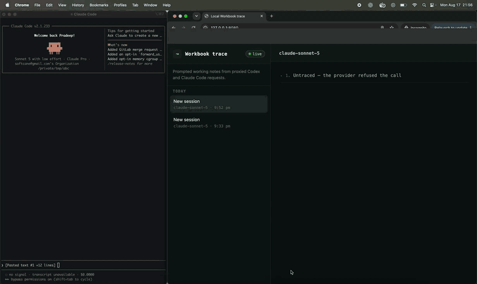

# agents-workbook

**Give your coding agent a workbook; it thinks out loud, writes down its reasoning, and you read along while it works.**

A local proxy that adds one tool to every request going out of Claude Code or Codex: somewhere to think out loud. The model writes, the notes land on a dashboard at `127.0.0.1:8080`, and your client gets back the ordinary reply. 

Not a summary. The default wording asks for the decision the model is making, the alternatives it rejected, and what each would have cost, at whatever length the problem earns. Notes run long, and that is the point.

I built this to answer the question like: does an agent's stated plan match what it goes on to do?

## See it



## Don't use this to farm reasoning

> [!CAUTION]
> **This is a fun experiment. It is not a data collection tool.**
>
> Do not use it to distill, mine, or reconstruct reasoning traces from Anthropic's or OpenAI's models. Do not train on what it captures. Do not build a dataset out of it, publish one, or use the notes to reproduce a model's behaviour anywhere else.
>
> A workbook note is ordinary model output, written through an ordinary tool call, on your machine, for your session, so that you can watch your own agent work. That is the entire intended use. Harvesting it is a violation of both providers' terms, and it is not what this is for.

## Run it

Docker builds the application with the repository's Maven wrapper, so you do not need Maven on the host. The first build downloads the Maven dependencies.

```bash
docker compose up -d --build
```

Open [http://127.0.0.1:8080](http://127.0.0.1:8080) and leave the tab open.

You see each workbook note stream as the model writes it. The dashboard keeps separate CLI sessions in separate rows and updates each turn's output-token total after the client reply finishes.

Claude Code:

```bash
ANTHROPIC_BASE_URL=http://127.0.0.1:10000 claude
```

Codex:

```bash
codex --disable enable_request_compression \
  -c 'model_provider="workbook_proxy"' \
  -c 'model_providers.workbook_proxy.name="Local Workbook Proxy"' \
  -c 'model_providers.workbook_proxy.base_url="http://127.0.0.1:10000/backend-api/codex"' \
  -c 'model_providers.workbook_proxy.wire_api="responses"' \
  -c 'model_providers.workbook_proxy.requires_openai_auth=true' \
  -c 'model_providers.workbook_proxy.supports_websockets=false'
```

`docker compose down` stops it. Nothing reaches disk unless you set `WORKBOOK_ARCHIVE_PATH`.

## Read this before you run it

> [!WARNING]
> **This burns tokens.** Each turn makes two provider calls instead of one, and up to four when the model keeps writing notes. Every call carries the whole conversation history, so your input cost doubles. The note itself then adds hundreds to thousands of output tokens per turn, on top of the answer you actually wanted. On a subscription that eats your rate limit. On an API key it eats money. Thinking out loud is not free.

> [!WARNING]
> **Your answer starts later.** The proxy waits for the full note before your reply begins streaming. The hidden call gets 60 seconds before the proxy gives up and sends your original request instead.

> [!CAUTION]
> **You are modifying requests that carry your own subscription credentials.** Anthropic and OpenAI both support pointing their CLIs at a custom base URL, so the routing itself is a documented setting. Adding a tool to the request is my doing, and running it is yours. Read your provider's terms and make your own call.

> [!CAUTION]
> **Notes can leak secrets.** The tool asks the model to keep credentials out of them. That is a request, not a boundary. If you paste an API key into a prompt, assume it can surface in a note.

## What it does not do

It does not read, expose, or try to recover any provider's protected internal reasoning; that's not possible. A workbook note is model output written through an ordinary tool call, no different from any other tool argument the model produces.

Do not use captured notes to train or improve a model.

## Hiring

I am open to AI engineering roles. This project is a fair sample of how I work: [github.com/softcane](https://github.com/softcane), softcane@gmail.com.

## License

Apache 2.0, see `LICENSE` and `NOTICE`. Not affiliated with, endorsed by, or sponsored by Anthropic or OpenAI.
